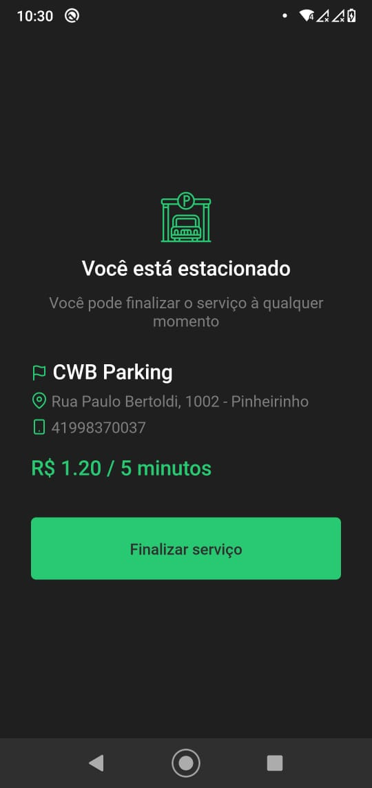

<h3 align="center">🚗</h3>

<br />

<h4 align="center">
	Under development...
</h4>

<p align="center">
 <a href="#bulb-objective">Objective</a> •
 <a href="#star-screens">Screens</a> •
 <a href="#gear-technologies">Technologies</a> •
 <a href="#information_source-how-to-use">How to use</a> •
 <a href="#hand-author">Author</a>
</p>

---

## :bulb: Objective

Integrate the best technologies to facilitate parking through a functional, beautiful and friendly interface.

## :star: Screens

<div align="center">




</div>

## :gear: Technologies

- React Native
- TypeScript
- Context API
- Unform
- Styled Components
- React native vector icons
- QRCode scanner
- React native camera
- React Navigation (Stack and Drawer)
- Yup
- Axios

## :information_source: How to use

To clone and run this application, you'll need Git, Node.js v10.16 or higher + Yarn v1.13 or higher installed on your computer. From your command line:

```bash
  ## Clone this repository
  $ git clone

  ## Go into the repository
  $ cd easy-parking

  ## Install dependencies
  $ yarn install

  ## Run the metro bundler
  $ yarn start

  ## Run the app
  $ yarn android
        or
  $ yarn ios
```

## :hand: Author


Pedrito
